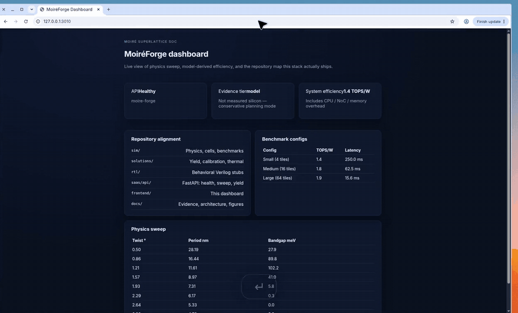
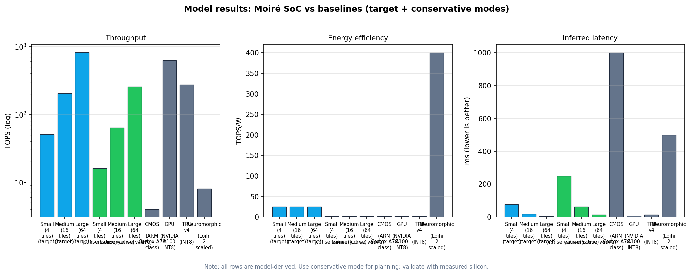
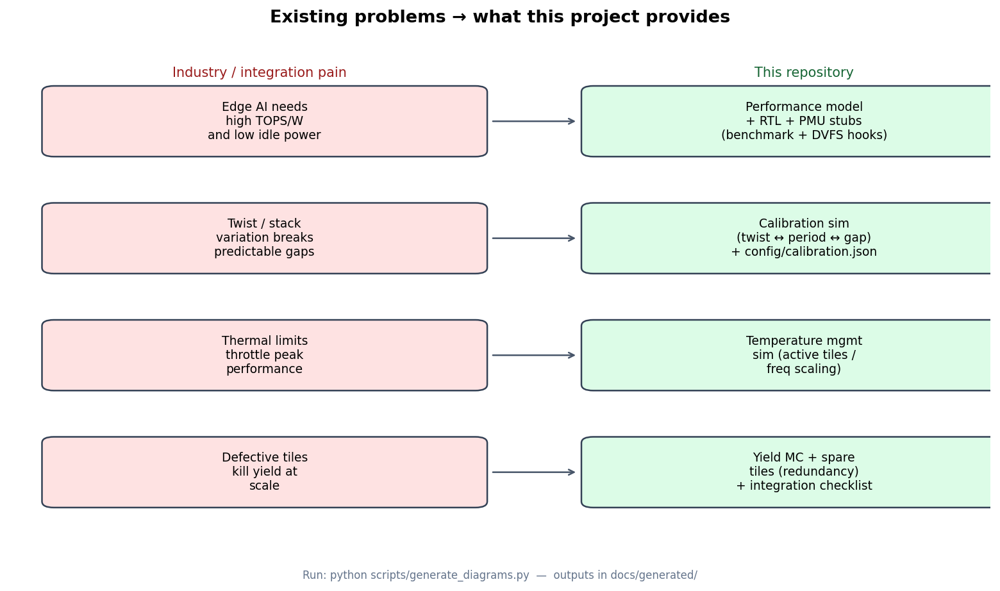
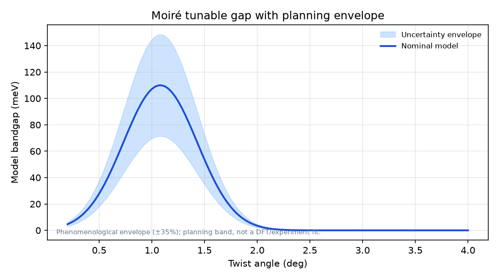
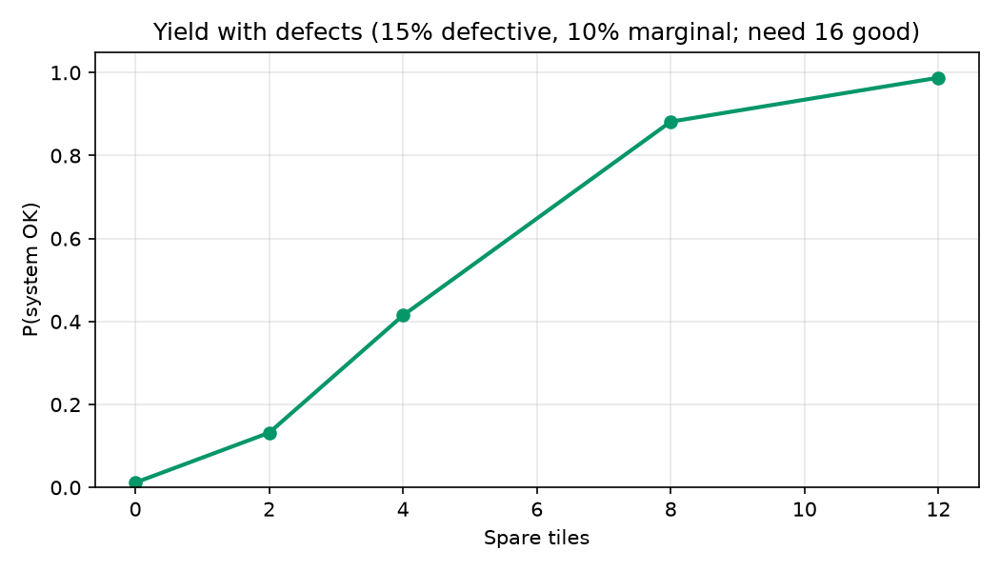
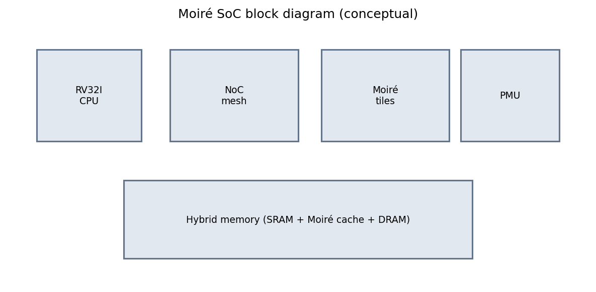

<div align="center">

# MoiréForge

**Moiré superlattice SoC framework for edge AI exploration**

A hybrid **CMOS + Moiré accelerator** stack you can run: physics envelopes, system-power benchmarks, yield/thermal solutions, behavioral RTL, FastAPI, and a live dashboard.

[](#quick-start)
[](#quick-start)
[](docs/EVIDENCE_TIERS.md)
[](#watch-the-demo)

</div>

MoiréForge lets you explore a *twist-angle* compute idea without pretending the silicon already exists. Twist a bilayer → the superlattice period changes → the model bandgap envelope moves → tile count and **system** TOPS/W (CPU / NoC / SRAM / DRAM / leakage included) follow. Conservative mode is the planning default.

> **Honesty first:** reported TOPS / TOPS/W are **model-derived**, not measured silicon. See [Evidence tiers](docs/EVIDENCE_TIERS.md).

---

## Watch the demo

This walkthrough **plays on this page** — it does not download a file.

<p align="center">
  
</p>

The clip is the Next.js dashboard (`frontend/`) talking to FastAPI (`saas/api/`) — the same tree this README lists.

| Time in clip | What you are seeing | Why it matters |
| --- | --- | --- |
| KPIs | API healthy, evidence = **model**, system TOPS/W | You immediately know this is a planning model, not a datasheet |
| Repository alignment | `sim/` · `solutions/` · `rtl/` · `saas/api/` · `frontend/` · `docs/` | The dashboard names folders that actually exist at repo root |
| Benchmark configs | Small / Medium / Large tiles, TOPS/W, latency | Conservative mode includes system power overhead |
| Physics sweep | Twist ° → period nm → bandgap meV | The live `/physics/sweep` call is the same model as `python -m sim.moire_physics` |

---

## In plain English

Edge AI wants more TOPS/W than CMOS alone is giving. Moiré materials are interesting because a **tiny twist** between 2D layers creates a large superlattice — in principle a tunable gap. This repo turns that sentence into something you can execute:

```text
Twist angle  →  Moiré period  →  Bandgap envelope (with uncertainty)
             →  Logic-cell abstraction
             →  Tile count × power (accel + system overhead)
             →  Yield under defects  +  RTL stubs
```

If a number cannot be reproduced from `sim/` + `config/`, it does not belong on the dashboard.

---

## Highlights

| Area | What you get |
|------|----------------|
| Physics | Twist → period → bandgap envelope, exciton/mobility heuristics |
| Performance | Target vs conservative modes + **system** power overhead |
| Yield / reliability | Redundancy MC, defect/marginal tiles, thermal throttle |
| Hardware path | Behavioral Verilog stubs (CPU, tiles, NoC, PMU) |
| Software | FastAPI, Next.js dashboard scaffold, Python SDK stub |
| Reproducibility | One-command `scripts/reproduce.py` + manifest |

---

## Quick start

```bash
pip install -r requirements.txt

# Full reproducible run (tests, sims, figures, report, manifest)
python scripts/reproduce.py

# Or step by step
python -m sim.moire_physics
python -m sim.moire_logic_cell
python -m sim.performance_benchmark
python -m pytest tests -q
```

**Windows (PowerShell):**

```powershell
.\run.ps1 test
.\run.ps1 diagrams
.\run.ps1 sim
.\run.ps1 reproduce
.\run.ps1 help
```

**API + dashboard (optional):**

```powershell
.\run.ps1 api    # http://127.0.0.1:8000
.\run.ps1 web    # http://localhost:3000  (requires Node.js)
```

**Verilog (optional, needs Icarus Verilog):**

```bash
make verilog
```

---

## Visual results

Regenerate anytime with `python scripts/generate_diagrams.py` or `.\run.ps1 diagrams`.

<p align="center">
  
</p>

<p align="center"><sub>System TOPS/W includes CPU / NoC / SRAM / DRAM / leakage overhead — target vs conservative vs baselines</sub></p>

<p align="center">
  
</p>

<p align="center"><sub>How this repo maps real edge-AI / integration pain points to executable tools</sub></p>

| Bandgap envelope | Yield under defects |
|:---:|:---:|
|  |  |

<p align="center">
  
</p>

<p align="center"><sub>Conceptual SoC block diagram (RTL is behavioral / stub-level today)</sub></p>

---

## Example model output

Workload: ResNet-50 INT8 · 4 GOp/inference · **Medium (16 tiles)** · `physics_target`

| Metric | Value |
|--------|------:|
| Throughput | 204.8 TOPS |
| Accelerator power | 8.0 W |
| System overhead | ~4.5 W |
| **System power** | **~12.5 W** |
| Accel efficiency | 25.6 TOPS/W |
| **System efficiency** | **~16.4 TOPS/W** |
| Latency | 19.5 ms |

Full tables: [Market comparison](docs/MARKET_COMPARISON.md)

---

## Repository map

```text
moireforge/
├── sim/                 # Physics, logic cells, benchmarks, literature anchors
├── solutions/           # Calibration, yield, temperature, integration
├── transport/           # Ballistic / tunneling helpers
├── digital_twin/        # Aging / defect-rate stubs
├── rtl/                 # Behavioral Verilog (CPU, tiles, NoC, PMU)
├── firmware/            # Boot + driver stubs
├── software/            # Python SDK stub
├── eda/                 # Synthesis / P&R script stubs
├── saas/api/            # FastAPI (physics, benchmark, yield)
├── frontend/            # Next.js dashboard (this demo UI)
├── scripts/             # reproduce, diagrams, market table, RTL lint
├── tests/               # pytest suite
├── docs/                # Architecture, evidence, literature, methods
│   └── demo.mp4         # Product walkthrough
├── config/              # calibration.json (physics + system overhead)
├── requirements.txt
├── run.ps1 / run.bat
└── Makefile
```

---

## Architecture (short)

- **Control:** minimal in-house RV32I stub (`rtl/riscv_cpu_core.v`)
- **Compute:** Moiré accelerator tiles (4–64 in the model)
- **Fabric:** mesh NoC stub, hybrid memory story, PMU/DVFS hooks
- **Flow:** physics → logic abstraction → RTL stubs → workload model

Details: [SoC architecture](docs/SOC_ARCHITECTURE.md)

---

## Evidence & honesty

| Tier | Meaning |
|------|---------|
| **1 – Executable** | Sims, solutions, tests, figures, `results/manifest.json` |
| **2 – Prototype** | Behavioral RTL / firmware / EDA stubs |
| **3 – Future** | Measured silicon, PDK signoff, production runtime |

- [Evidence tiers](docs/EVIDENCE_TIERS.md)
- [Limitations & resolution plan](docs/LIMITATIONS_AND_RESOLUTION_PLAN.md)
- [Literature validation](docs/LITERATURE_VALIDATION.md)
- [Methods snapshot](docs/METHODS_SNAPSHOT.md)
- [Reproduce guide](REPRODUCE.md)

---

## Docs & legal

| Doc | Purpose |
|-----|---------|
| [QUICK_START.md](QUICK_START.md) | Short command cheat sheet |
| [REPRODUCE.md](REPRODUCE.md) | Clean-machine reproduction |
| [LEGAL.md](LEGAL.md) | Attribution policy |
| [THIRD_PARTY_LICENSES.md](THIRD_PARTY_LICENSES.md) | Third-party notices |
| [CONTRIBUTING.md](CONTRIBUTING.md) | How to contribute |

---

## License

Research and educational use. See project legal docs for attribution policy.

---

**MoireQuantum Edge Processor** · Last updated 2026-09-10
